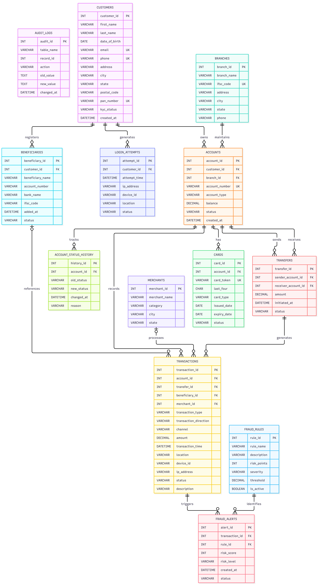

# Banking Transaction Management and SQL-Based Fraud Detection System

A MySQL-based banking database project designed to manage customer accounts, banking transactions, fund transfers, and account activities while identifying potentially suspicious transactions through SQL-based fraud detection rules.

## Table of Contents

- [Project Abstract](#project-abstract)
- [Problem Statement](#problem-statement)
- [Objectives](#objectives)
- [ER Diagram](#er-diagram)
- [Database Schema and Relationships](#database-schema-and-relationships)
- [SQL Implementation](#sql-implementation)
- [Screenshots](#screenshots)
- [Testing and Validation](#testing-and-validation)
- [Conclusion](#conclusion)
- [Future Enhancements](#future-enhancements)
- [Technologies Used](#technologies-used)

---

## Project Abstract

The Banking Transaction Management and SQL-Based Fraud Detection System is a relational database project developed using MySQL. It models essential banking operations, including customer registration, account management, beneficiary registration, card management, fund transfers, and transaction recording.

The system uses relational constraints to maintain data integrity and SQL queries to retrieve meaningful banking information. Stored procedures are implemented for deposits, withdrawals, and fund transfers, while SQL functions classify transactions based on transaction amounts.

The project also incorporates a rule-based fraud detection mechanism that identifies potentially suspicious activities, such as high-value transactions, rapid transaction patterns, and repeated failed login attempts. Views, triggers, and audit logs support reporting and activity tracking.

The project demonstrates how SQL database features can be combined to build a structured banking management and transaction monitoring system.

## Problem Statement

Banking systems handle large volumes of customer information, account records, and financial transactions. Managing these records requires a structured database that ensures data consistency, supports reliable transaction processing, and helps identify suspicious activities.

A poorly structured system may lead to data inconsistencies, inefficient reporting, and difficulty tracking account or transaction changes.

This project addresses these challenges by designing a relational banking database with integrity constraints, transaction-processing procedures, reporting queries, audit mechanisms, and rule-based fraud detection.

## Objectives

- Design a relational database for banking operations.
- Maintain relationships between customers, branches, accounts, and transactions.
- Enforce data integrity using primary keys, foreign keys, unique constraints, and check constraints.
- Implement deposit, withdrawal, and fund transfer operations using stored procedures.
- Use SQL functions to classify transactions by amount.
- Develop views for simplified reporting and analysis.
- Maintain account status history and audit logs using triggers.
- Identify suspicious transaction patterns using predefined fraud rules.
- Validate database operations through SQL testing and error handling.

## ER Diagram

The Entity Relationship Diagram illustrates the database tables, primary keys, foreign keys, and relationships between banking entities.

## Database Schema and Relationships

The database contains **13 relational tables**.

| Table | Description |
|---|---|
| `customers` | Stores customer information and KYC status. |
| `branches` | Stores bank branch details and IFSC codes. |
| `accounts` | Maintains customer accounts, balances, and account status. |
| `beneficiaries` | Stores registered beneficiary information. |
| `cards` | Maintains card tokens, last four digits, type, and status. |
| `merchants` | Stores merchant information for payment records. |
| `transfers` | Records sender, receiver, transfer amount, and status. |
| `transactions` | Stores deposits, withdrawals, transfers, and payments. |
| `login_attempts` | Records customer login attempts and associated details. |
| `account_status_history` | Tracks account status changes. |
| `fraud_rules` | Defines fraud detection rules and risk levels. |
| `fraud_alerts` | Stores alerts generated against transactions and rules. |
| `audit_logs` | Maintains records of selected database changes. |

### Key Relationships

- One customer can own multiple accounts.
- One branch can maintain multiple accounts.
- One customer can register multiple beneficiaries.
- One customer can generate multiple login attempt records.
- One account can have multiple cards.
- One account can have multiple transactions.
- One account can have multiple status history records.
- A transfer connects sender and receiver accounts.
- A transfer can be associated with transaction records.
- A transaction can be associated with a beneficiary or merchant.
- One fraud rule can identify multiple fraud alerts.
- One transaction can be associated with multiple fraud alerts, subject to the transaction-rule uniqueness constraint.

## SQL Implementation

The project uses MySQL features across the following implementation stages.

### 1. Database and Table Creation

- Database creation and selection.
- Creation of 13 relational tables.
- Primary key and foreign key definitions.
- Unique and check constraints.
- ENUM data types and default values.

### 2. Sample Data Insertion

Sample records were inserted for customers, branches, accounts, beneficiaries, cards, merchants, transactions, transfers, and login attempts.

### 3. Basic SQL Queries

- Filtering using `WHERE`.
- Sorting using `ORDER BY`.
- Aggregate functions such as `COUNT()`, `SUM()`, and `AVG()`.
- Grouping using `GROUP BY` and filtering using `HAVING`.
- Multi-table joins.

### 4. Advanced SQL Analytics

- Subqueries.
- Common table expressions where applicable.
- Window functions.
- Running transaction totals.
- High-value transaction analysis.
- Customer-level transaction summaries.

### 5. Views

The project implements five views:

- `customer_account_summary`
- `transaction_details_view`
- `high_value_transactions`
- `customer_transaction_summary`
- `failed_login_summary`

### 6. Stored Procedures and Function

| SQL Object | Purpose |
|---|---|
| `deposit_money` | Processes deposits and updates account balances. |
| `withdraw_money` | Validates and processes withdrawals. |
| `transfer_money` | Processes transfers between accounts. |
| `classify_transaction` | Classifies transactions into risk categories based on amount. |

The procedures use transaction control and validation logic to help maintain consistency during financial operations.

### 7. Triggers and Audit Logging

Triggers are used to:

- Record account balance or status changes.
- Maintain account status history.
- Insert audit records when selected account or transaction events occur.

### 8. Rule-Based Fraud Detection

The fraud detection component uses predefined rules, including:

- High-value transactions.
- Very high-value transactions.
- Rapid transactions within a defined time window.
- Repeated failed login attempts.

Detected events are stored in `fraud_alerts` with risk scores, risk levels, timestamps, and alert statuses.

## Screenshots

Screenshots of SQL commands and their outputs are available in the `Screenshots/` directory.

The screenshots cover the database setup, table creation, sample data, SQL queries, views, stored procedures, triggers, fraud detection, and final validation.

## Testing and Validation

The project was tested using SQL queries and procedure calls.

| Test Case | Expected Behaviour | Observed Result |
|---|---|---|
| Database creation | Create and select the project database | Successful |
| Table creation | Create the required relational tables | 13 tables present |
| Foreign key validation | Prevent invalid references | Referential constraints defined |
| Deposit procedure | Increase account balance for a valid deposit | Successful procedure execution |
| Withdrawal procedure | Reject withdrawal exceeding available balance | Rejected with insufficient balance error |
| Fund transfer | Update sender and receiver balances and record transfer transactions | Successful procedure execution |
| Transaction classification | Assign a risk category based on amount | Categories returned |
| Fraud detection | Identify matching high-value and rapid transaction patterns | Alerts generated |
| Views | Retrieve summarized banking information | View queries executed |
| Audit and status history | Record selected changes | Trigger-based records implemented |

**Note:** The dataset is illustrative and intended for academic demonstration. The fraud detection component uses predefined SQL rules and is not a production banking fraud prevention system.

## Conclusion

The project demonstrates the practical application of MySQL in designing and implementing a banking transaction management database.

Through relational schema design, SQL queries, stored procedures, functions, views, triggers, and audit logging, the system supports essential banking operations while maintaining data integrity.

The rule-based fraud detection component further demonstrates how SQL can be used to identify suspicious transaction patterns and generate alerts for review.

Overall, the project strengthened practical understanding of database design, transaction processing, SQL analytics, and database-level business logic.

## Future Enhancements

- Integrate a frontend dashboard for customer and administrator operations.
- Implement real-time transaction monitoring.
- Introduce machine learning models for fraud detection.
- Add role-based access control for banking staff and administrators.
- Improve transaction history and reconciliation mechanisms.
- Add automated notifications for suspicious activity.
- Deploy the database using a cloud-hosted MySQL service.
- Develop APIs to connect the database with external applications.

## Technologies Used

- **Database:** MySQL 8.0
- **Query Language:** SQL
- **Database Tools:** MySQL Workbench, MySQL Command Line Client
- **Concepts:** Relational Database Design, Joins, Subqueries, CTEs, Window Functions, Views, Stored Procedures, Functions, Triggers, Transactions, Constraints, Audit Logging

---

**Project Type:** Database Management System / SQL Project  
**Domain:** Banking and Financial Transaction Management
